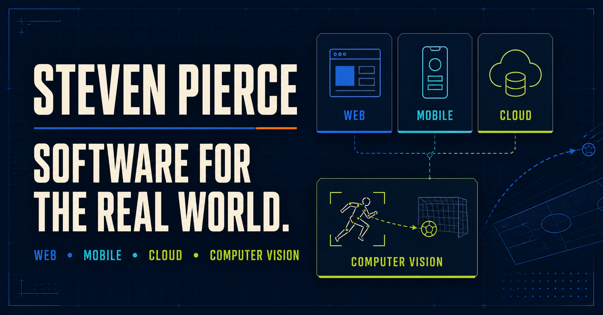

# Steven Pierce - Software Engineering Portfolio

[](https://portfolio.meetregistrationpv.com)
[](https://github.com/sppierce34/steven-pierce-engineering-portfolio/actions/workflows/ci.yml)



A public, recruiter-facing portfolio of production software projects spanning
web, mobile, cloud infrastructure, and computer vision. It includes detailed
case studies, authenticated product screenshots, architecture summaries,
engineering decisions, measurable outcomes, and links to live applications.

## Featured projects

| Project | Dates | Engineering evidence | Case study | Live application |
| --- | --- | --- | --- | --- |
| Pole Vault Meet Manager | Aug 2025 - Present | 509 registrations across 10 meets; web, iOS, Android, scoring, operations, and two-server failover | [Case study](https://portfolio.meetregistrationpv.com/projects/meet-manager) | [meetregistrationpv.com](https://meetregistrationpv.com) |
| PV Video Capture | Dec 2025 - Present | 30,605 labeling-ready frames; segmentation and vault-phase models; multi-camera capture and clip delivery | [Case study](https://portfolio.landoncheckin.com/projects/video-capture) | [landoncheckin.com](https://landoncheckin.com) |
| Landon Pole Rental | Jun 2026 - Present | Cross-platform inventory, agreements, payments, staff workflows, and recurring billing | [Case study](https://portfolio.pole-rental.com/projects/pole-rental) | [pole-rental.com](https://pole-rental.com) |

## Technology

- TypeScript, JavaScript, React, React Native, Expo Router, Python, Flask, and FastAPI
- OpenCV, Ultralytics YOLO, FFmpeg, segmentation, model training, and validation
- Cloudflare Workers, D1, R2, Stream, Tunnel, and Load Balancing
- PostgreSQL/Neon, Convex, Stripe, Linux, systemd, monitoring, backup, and recovery
- Agentic development workflows for implementation, testing, debugging, code review, and documentation

## Repository map

- `app/`, `components/`, `lib/`, and `worker/` contain the public portfolio application.
- `public/projects/` contains approved recruiter-facing screenshots.
- `docs/projects/` contains the verified source notes behind each case study.
- `docs/agent-handoff.md` and `docs/change-log.md` preserve continuity for future work.
- `SECURITY.md` explains the public repository's security and disclosure boundary.

## Local development

Requires Node.js 22.13 or newer.

```bash
npm install
npm run dev
```

Run the production build, rendered-page tests, and lint checks with:

```bash
npm test
npm run lint
npm audit --audit-level=high
```

## Public-release boundary

This repository intentionally contains the public portfolio application and
high-level engineering documentation. Production application source
repositories remain private. Credentials, athlete/customer records,
infrastructure addresses, tunnel identifiers, database connection details,
and proprietary private-application source do not belong here. See
[`docs/public-content-guidelines.md`](docs/public-content-guidelines.md).
